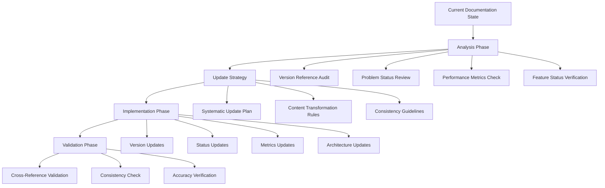

# Design Document

## Overview

This design outlines the systematic approach to update the Estia AI documentation to accurately reflect the current v6.0 fusion architecture status. The update will transform outdated documentation that still references v5 and lists unresolved issues into accurate documentation that reflects the fully implemented v6.0 system with all features operational and excellent performance metrics achieved.

The design focuses on maintaining documentation consistency while ensuring all stakeholders have accurate information about the system's current capabilities, performance, and implementation status.

## Architecture

### Documentation Update Architecture



### Update Scope and Priority

**High Priority Files:**
1. `docs/fusion_architecture_v6_implementation_plan.md` - Core implementation status
2. `README.md` - Main project documentation
3. `CLAUDE.md` - Development guidance
4. `docs/complete_workflow_detailed.md` - Technical workflow documentation

**Medium Priority Files:**
- Other documentation files in `docs/` directory
- Configuration and setup documentation

## Components and Interfaces

### 1. Version Reference Updater

**Purpose**: Systematically update all version references from v5 to v6

**Key Updates:**
- Version numbers in headers and titles
- Performance metrics and benchmarks
- Feature availability statements
- Implementation status indicators

**Interface:**
```markdown
# Before
Estia AI 记忆系统主接口 v5.0.0 - 六大模块架构版本

# After  
Estia AI 记忆系统主接口 v6.0.0 - 融合架构版本
```

### 2. Problem Status Transformer

**Purpose**: Convert problem statements from unresolved to resolved status

**Transformation Rules:**
```markdown
# Before
- ❌ 新系统功能不完整
- ❌ 缺少完整的工作流程
- ❌ 异步评估机制不完善
- ❌ 缺少会话管理
- ❌ 缺少记忆分层
- ❌ 缺少用户画像

# After
- ✅ 新系统功能完整 (v6.0已解决)
- ✅ 完整的工作流程 (15步流程已实现)
- ✅ 异步评估机制完善 (AsyncFlowManager已实现)
- ✅ 会话管理完整 (会话系统已实现)
- ✅ 记忆分层完整 (4层分级已实现)
- ✅ 用户画像完整 (画像系统已实现)
```

### 3. Performance Metrics Updater

**Purpose**: Update all performance metrics to reflect actual v6.0 benchmarks

**Key Metrics to Update:**
- Query Processing Speed: >300 QPS → **671.60 QPS**
- Average Response Time: <50ms → **1.49ms**
- Cache Hit Rate: >80% → **100%**
- Cache Acceleration: 588x → **588x** (confirmed)
- Vector Retrieval Time: <50ms → **<1ms**
- System Initialization: <10s → **7.1s**

### 4. Feature Status Updater

**Purpose**: Mark all implemented features as available and operational

**Status Transformations:**
- Implementation phases: 📋 Planned → ✅ Complete
- Feature availability: ⚠️ Experimental → ✅ Production Ready
- Component status: 🔄 In Progress → ✅ Operational

### 5. Architecture Documentation Updater

**Purpose**: Ensure architecture descriptions match current v6.0 implementation

**Key Updates:**
- Manager descriptions and responsibilities
- Workflow step implementations
- Component integration status
- System capabilities and limitations

## Data Models

### Documentation Update Record

```typescript
interface DocumentationUpdate {
  file_path: string;
  update_type: 'version' | 'status' | 'metrics' | 'features' | 'architecture';
  changes: {
    before: string;
    after: string;
    line_numbers?: number[];
  }[];
  validation_status: 'pending' | 'validated' | 'failed';
  update_timestamp: string;
}
```

### Update Validation Schema

```typescript
interface ValidationResult {
  file_path: string;
  consistency_check: boolean;
  cross_reference_check: boolean;
  accuracy_verification: boolean;
  issues_found: string[];
  overall_status: 'pass' | 'fail' | 'warning';
}
```

## Error Handling

### Update Conflict Resolution

**Scenario**: Conflicting information between different documentation files
**Resolution**: Use the project analysis report as the authoritative source

**Scenario**: Outdated performance metrics in multiple locations
**Resolution**: Apply consistent updates based on actual v6.0 benchmarks

**Scenario**: Inconsistent feature status across documents
**Resolution**: Mark all features as implemented based on code analysis

### Validation Failures

**Missing Updates**: If any v5 references remain after update
**Action**: Systematic search and replace with validation

**Inconsistent Status**: If problem status doesn't match across documents
**Action**: Apply consistent resolved status with explanatory notes

**Metric Discrepancies**: If performance numbers don't match
**Action**: Use verified v6.0 benchmarks consistently

## Testing Strategy

### Pre-Update Validation
1. **Documentation Audit**: Catalog all current version references and problem statements
2. **Cross-Reference Mapping**: Identify all locations requiring updates
3. **Baseline Establishment**: Document current state for comparison

### Update Validation
1. **Consistency Check**: Ensure all version references are updated consistently
2. **Cross-Reference Validation**: Verify related sections are updated together
3. **Accuracy Verification**: Confirm all updates reflect actual system capabilities

### Post-Update Testing
1. **Documentation Review**: Manual review of key documentation files
2. **Link Validation**: Ensure all internal references remain valid
3. **Stakeholder Review**: Validation by development team and users

### Validation Criteria

**Version Consistency**: All documents reference v6.0 as current version
**Status Accuracy**: All problems marked as resolved with appropriate explanations
**Metrics Accuracy**: All performance metrics reflect actual v6.0 benchmarks
**Feature Completeness**: All implemented features marked as available
**Architecture Alignment**: All architecture descriptions match current implementation

## Implementation Approach

### Phase 1: Critical Documentation Updates
- Update `docs/fusion_architecture_v6_implementation_plan.md`
- Update main `README.md` 
- Update `CLAUDE.md` development guidance

### Phase 2: Supporting Documentation Updates
- Update workflow documentation
- Update technical specifications
- Update configuration guides

### Phase 3: Validation and Quality Assurance
- Cross-reference validation
- Consistency verification
- Accuracy confirmation

### Update Methodology

1. **Systematic Search and Replace**: Use consistent patterns for version updates
2. **Context-Aware Updates**: Ensure updates make sense in context
3. **Preservation of Intent**: Maintain original documentation purpose while updating facts
4. **Enhancement Opportunities**: Add clarifying information where beneficial

## Quality Assurance

### Documentation Standards
- Maintain consistent formatting and style
- Preserve existing documentation structure
- Ensure technical accuracy
- Maintain readability and clarity

### Review Process
1. **Technical Review**: Verify technical accuracy of updates
2. **Editorial Review**: Ensure clarity and consistency
3. **Stakeholder Review**: Confirm updates meet user needs
4. **Final Validation**: Comprehensive check before completion

This design ensures a systematic, thorough, and accurate update of all documentation to reflect the current v6.0 fusion architecture status while maintaining high quality and consistency standards.