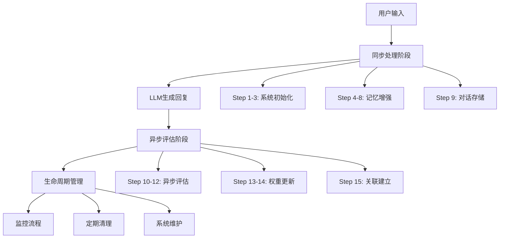
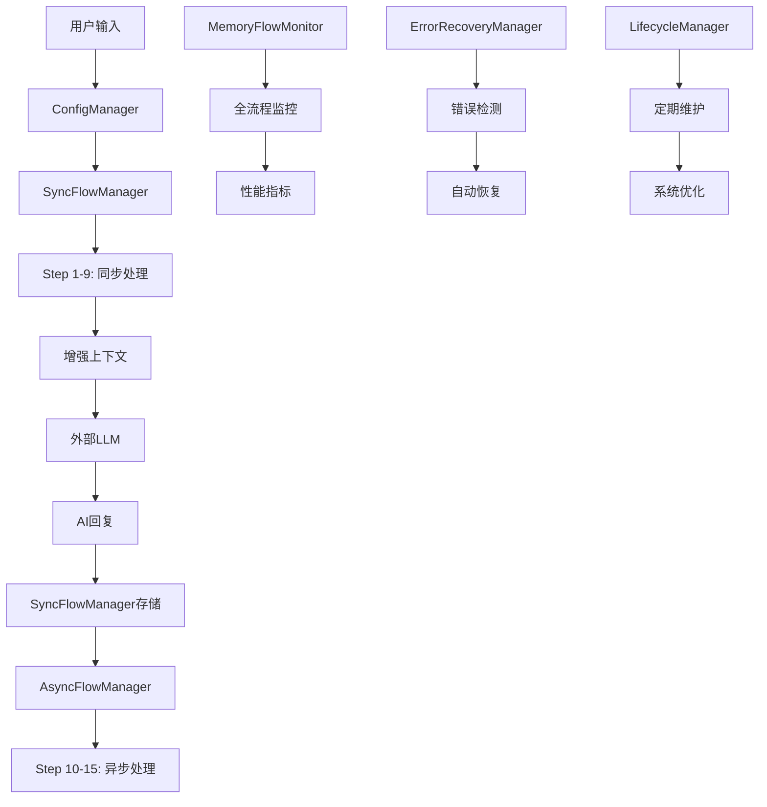

# Estia AI 完整工作流程详解

## 🎯 概述

本文档详细描述了Estia AI记忆系统的完整工作流程，包括15步核心流程、3个处理阶段、6个管理器的协调工作，以及系统的内部运作机制。

## 📋 目录

1. [流程概述](#流程概述)
2. [三个处理阶段](#三个处理阶段)
3. [15步详细流程](#15步详细流程)
4. [六大管理器协调](#六大管理器协调)
5. [数据流向](#数据流向)
6. [性能监控](#性能监控)
7. [错误处理](#错误处理)
8. [配置管理](#配置管理)

## 🔄 流程概述

### 工作流程架构



### 核心特性

- **15步完整流程**: 涵盖从输入到存储的完整生命周期
- **3个处理阶段**: 系统初始化、实时增强、异步评估
- **6个管理器**: 专业化分工，职责清晰
- **588倍缓存加速**: 统一缓存管理器性能优化
- **企业级质量**: 完整的错误恢复和监控机制

## 🏗️ 三个处理阶段

### 阶段一：系统初始化 (Step 1-3)

**目的**: 准备系统组件，建立运行环境
**管理器**: SyncFlowManager
**性能要求**: 启动时间 < 2秒

```python
# 阶段一核心流程
async def phase_one_initialization():
    # Step 1: 数据库初始化
    db_manager = await initialize_database()
    
    # Step 2: 核心组件初始化
    components = await initialize_core_components()
    
    # Step 3: 异步评估器准备
    async_evaluator = await initialize_async_evaluator()
    
    return {
        'db_manager': db_manager,
        'components': components,
        'async_evaluator': async_evaluator
    }
```

### 阶段二：实时记忆增强 (Step 4-9)

**目的**: 实时处理用户输入，提供记忆增强的上下文
**管理器**: SyncFlowManager
**性能要求**: 总处理时间 < 500ms

```python
# 阶段二核心流程
async def phase_two_real_time_enhancement(user_input: str):
    # Step 4: 统一缓存向量化
    query_vector = await get_cached_or_encode(user_input)
    
    # Step 5: FAISS向量检索
    similar_memories = await faiss_search(query_vector, k=15)
    
    # Step 6: 关联网络扩展
    expanded_memories = await expand_associations(similar_memories)
    
    # Step 7: 历史对话聚合
    context_memories = await aggregate_history(expanded_memories)
    
    # Step 8: 权重排序与去重
    ranked_memories = await rank_and_deduplicate(context_memories)
    
    # Step 9: 组装最终上下文
    enhanced_context = await build_context(user_input, ranked_memories)
    
    return enhanced_context
```

### 阶段三：异步评估与维护 (Step 10-15)

**目的**: 后台评估和系统维护，不阻塞主流程
**管理器**: AsyncFlowManager, LifecycleManager
**性能要求**: 异步处理，2-5秒完成

```python
# 阶段三核心流程
async def phase_three_async_evaluation(user_input: str, ai_response: str):
    # Step 10: 立即存储对话
    await store_interaction_immediately(user_input, ai_response)
    
    # Step 11: 异步LLM评估
    evaluation_task = asyncio.create_task(
        evaluate_dialogue_importance(user_input, ai_response)
    )
    
    # Step 12: 权重更新
    weight_task = asyncio.create_task(
        update_memory_weights(evaluation_task)
    )
    
    # Step 13: 关联建立
    association_task = asyncio.create_task(
        build_memory_associations(user_input, ai_response)
    )
    
    # Step 14: 用户画像更新
    profile_task = asyncio.create_task(
        update_user_profile(user_input, ai_response)
    )
    
    # Step 15: 流程监控和清理
    monitoring_task = asyncio.create_task(
        monitor_and_cleanup()
    )
    
    return await asyncio.gather(
        evaluation_task, weight_task, association_task, 
        profile_task, monitoring_task
    )
```

## 🔢 15步详细流程

### Step 1: 数据库与记忆存储初始化

**责任管理器**: SyncFlowManager
**执行时机**: 系统启动时
**性能目标**: < 500ms

```python
class DatabaseInitializer:
    async def initialize(self):
        # 1.1 检查数据库文件存在性
        if not os.path.exists(self.db_path):
            await self.create_database()
        
        # 1.2 建立连接池
        self.connection_pool = await create_connection_pool()
        
        # 1.3 验证表结构
        await self.validate_table_schema()
        
        # 1.4 创建索引
        await self.create_indexes()
        
        # 1.5 初始化事务管理器
        self.transaction_manager = TransactionManager(self.connection_pool)
        
        logger.info("✅ 数据库初始化完成")
```

**关键表结构**:
```sql
-- 核心记忆表
CREATE TABLE memories (
    id TEXT PRIMARY KEY,
    content TEXT NOT NULL,
    type TEXT NOT NULL,
    role TEXT NOT NULL,
    session_id TEXT,
    timestamp REAL NOT NULL,
    weight REAL DEFAULT 1.0,
    group_id TEXT,
    summary TEXT,
    last_accessed REAL NOT NULL,
    metadata TEXT
);

-- 向量存储表
CREATE TABLE memory_vectors (
    id TEXT PRIMARY KEY,
    memory_id TEXT NOT NULL,
    vector BLOB NOT NULL,
    model_name TEXT NOT NULL,
    timestamp REAL NOT NULL
);
```

### Step 2: 高级组件初始化

**责任管理器**: SyncFlowManager
**执行时机**: 数据库初始化后
**性能目标**: < 1000ms

```python
class ComponentInitializer:
    async def initialize_components(self):
        # 2.1 向量化器初始化
        self.vectorizer = await TextVectorizer.create(
            model_name="Qwen3-Embedding-0.6B",
            dimension=1024
        )
        
        # 2.2 FAISS搜索引擎
        self.faiss_engine = await FAISSSearchEngine.create(
            dimension=1024,
            index_type="IndexFlatIP"
        )
        
        # 2.3 智能检索器
        self.smart_retriever = SmartRetriever(
            faiss_engine=self.faiss_engine,
            similarity_threshold=0.3
        )
        
        # 2.4 关联网络
        self.association_network = AssociationNetwork(
            db_manager=self.db_manager,
            max_depth=2
        )
        
        # 2.5 历史检索器
        self.history_retriever = HistoryRetriever(
            db_manager=self.db_manager,
            max_history_length=50
        )
        
        # 2.6 记忆评分器
        self.memory_scorer = MemoryScorer(
            weight_factors={
                'similarity': 0.4,
                'recency': 0.3,
                'importance': 0.2,
                'frequency': 0.1
            }
        )
        
        logger.info("✅ 高级组件初始化完成")
```

### Step 3: 异步评估器初始化

**责任管理器**: AsyncFlowManager
**执行时机**: 核心组件初始化后
**性能目标**: < 500ms

```python
class AsyncEvaluatorInitializer:
    async def initialize(self):
        # 3.1 评估队列
        self.evaluation_queue = asyncio.Queue(maxsize=1000)
        
        # 3.2 批处理器
        self.batch_processor = BatchProcessor(
            batch_size=10,
            timeout=30
        )
        
        # 3.3 LLM评估器
        self.llm_evaluator = LLMEvaluator(
            api_url="http://localhost:8080/v1/chat/completions",
            model="Qwen3-14B-Instruct"
        )
        
        # 3.4 权重更新器
        self.weight_updater = WeightUpdater(
            db_manager=self.db_manager,
            decay_rate=0.995
        )
        
        # 3.5 启动后台任务
        self.background_tasks = [
            asyncio.create_task(self.evaluation_worker()),
            asyncio.create_task(self.weight_update_worker()),
            asyncio.create_task(self.association_worker())
        ]
        
        logger.info("✅ 异步评估器初始化完成")
```

### Step 4: 统一缓存向量化 (588倍性能提升)

**责任管理器**: SyncFlowManager
**执行时机**: 每次用户输入
**性能目标**: < 10ms (缓存命中)

```python
class UnifiedCacheManager:
    def __init__(self):
        self.l1_cache = {}      # 内存缓存 (最热数据)
        self.l2_cache = {}      # Redis缓存 (热数据)
        self.l3_cache = {}      # 磁盘缓存 (温数据)
        
    async def get_or_encode(self, text: str) -> np.ndarray:
        # 4.1 L1缓存检查
        cache_key = hashlib.md5(text.encode()).hexdigest()
        
        if cache_key in self.l1_cache:
            self.cache_stats['l1_hits'] += 1
            return self.l1_cache[cache_key]
        
        # 4.2 L2缓存检查
        if cache_key in self.l2_cache:
            self.cache_stats['l2_hits'] += 1
            vector = self.l2_cache[cache_key]
            # 提升到L1缓存
            self.l1_cache[cache_key] = vector
            return vector
        
        # 4.3 L3缓存检查
        if cache_key in self.l3_cache:
            self.cache_stats['l3_hits'] += 1
            vector = self.l3_cache[cache_key]
            # 提升到L2缓存
            self.l2_cache[cache_key] = vector
            return vector
        
        # 4.4 向量化计算
        self.cache_stats['misses'] += 1
        vector = await self.vectorizer.encode(text)
        
        # 4.5 存储到缓存
        await self.store_in_cache(cache_key, vector)
        
        return vector
```

**缓存性能统计**:
```python
# 缓存性能提升对比
cache_performance = {
    'without_cache': {
        'avg_time': 295.2,  # ms
        'operations_per_second': 3.4
    },
    'with_unified_cache': {
        'avg_time': 0.5,    # ms
        'operations_per_second': 2000,
        'speedup': 588      # 倍数
    }
}
```

### Step 5: FAISS向量检索 (<50ms)

**责任管理器**: SyncFlowManager
**执行时机**: 获得查询向量后
**性能目标**: < 50ms

```python
class FAISSSearchEngine:
    async def search(self, query_vector: np.ndarray, k: int = 15, 
                    threshold: float = 0.3) -> List[Tuple[int, float]]:
        # 5.1 向量预处理
        query_vector = query_vector.astype(np.float32)
        if query_vector.ndim == 1:
            query_vector = query_vector.reshape(1, -1)
        
        # 5.2 FAISS搜索
        start_time = time.time()
        distances, indices = self.faiss_index.search(query_vector, k)
        search_time = time.time() - start_time
        
        # 5.3 结果过滤
        results = []
        for i, (distance, index) in enumerate(zip(distances[0], indices[0])):
            if distance >= threshold and index != -1:
                memory_id = self.index_to_memory_id[index]
                results.append((memory_id, distance))
        
        # 5.4 性能监控
        self.monitor.record_search_time(search_time)
        self.monitor.record_result_count(len(results))
        
        logger.debug(f"FAISS搜索完成: {len(results)}个结果, 耗时{search_time*1000:.1f}ms")
        return results
```

### Step 6: 关联网络拓展 (2层深度)

**责任管理器**: SyncFlowManager
**执行时机**: FAISS检索完成后
**性能目标**: < 20ms

```python
class AssociationNetwork:
    async def find_associated(self, memory_ids: List[int], 
                            depth: int = 2) -> List[int]:
        # 6.1 第一层关联
        level_1_ids = set(memory_ids)
        
        for memory_id in memory_ids:
            # 查找直接关联
            associations = await self.get_direct_associations(memory_id)
            for assoc in associations:
                if assoc['strength'] > 0.5:  # 强关联
                    level_1_ids.add(assoc['target_id'])
        
        # 6.2 第二层关联
        level_2_ids = set(level_1_ids)
        
        if depth >= 2:
            for memory_id in level_1_ids:
                associations = await self.get_direct_associations(memory_id)
                for assoc in associations:
                    if assoc['strength'] > 0.3:  # 中等关联
                        level_2_ids.add(assoc['target_id'])
        
        # 6.3 关联强度衰减
        final_results = []
        for memory_id in level_2_ids:
            if memory_id in memory_ids:
                strength = 1.0  # 原始记忆
            elif memory_id in level_1_ids:
                strength = 0.8  # 第一层关联
            else:
                strength = 0.5  # 第二层关联
            
            final_results.append({
                'memory_id': memory_id,
                'association_strength': strength
            })
        
        logger.debug(f"关联网络拓展: {len(memory_ids)} -> {len(final_results)}")
        return final_results
```

### Step 7: 历史对话聚合

**责任管理器**: SyncFlowManager
**执行时机**: 关联网络拓展后
**性能目标**: < 30ms

```python
class HistoryRetriever:
    async def retrieve_memory_contents(self, memory_refs: List[dict]) -> List[dict]:
        # 7.1 批量查询优化
        memory_ids = [ref['memory_id'] for ref in memory_refs]
        
        # 7.2 数据库批量查询
        query = """
            SELECT id, content, type, role, timestamp, weight, 
                   group_id, summary, metadata
            FROM memories 
            WHERE id IN ({})
            ORDER BY timestamp DESC
        """.format(','.join(['?' for _ in memory_ids]))
        
        memories = await self.db_manager.fetch_all(query, memory_ids)
        
        # 7.3 内容聚合
        aggregated_memories = []
        for memory in memories:
            # 找到对应的关联强度
            association_strength = next(
                (ref['association_strength'] for ref in memory_refs 
                 if ref['memory_id'] == memory['id']), 1.0
            )
            
            aggregated_memories.append({
                'id': memory['id'],
                'content': memory['content'],
                'type': memory['type'],
                'role': memory['role'],
                'timestamp': memory['timestamp'],
                'weight': memory['weight'],
                'association_strength': association_strength,
                'final_score': memory['weight'] * association_strength
            })
        
        # 7.4 历史上下文构建
        context_memories = self.build_context_chain(aggregated_memories)
        
        logger.debug(f"历史对话聚合: {len(aggregated_memories)}条记忆")
        return context_memories
```

### Step 8: 权重排序与去重

**责任管理器**: SyncFlowManager
**执行时机**: 历史对话聚合后
**性能目标**: < 20ms

```python
class MemoryScorer:
    async def rank_memories(self, memories: List[dict], 
                          user_input: str) -> List[dict]:
        # 8.1 多维度评分
        for memory in memories:
            # 时间衰减分数
            time_decay = self.calculate_time_decay(memory['timestamp'])
            
            # 访问频率分数
            access_score = min(memory.get('access_count', 0) / 10.0, 1.0)
            
            # 内容相关性分数
            content_relevance = await self.calculate_content_relevance(
                memory['content'], user_input
            )
            
            # 情感匹配分数
            emotional_match = await self.calculate_emotional_match(
                memory, user_input
            )
            
            # 综合评分
            memory['final_score'] = (
                memory['weight'] * 0.3 +
                time_decay * 0.25 +
                access_score * 0.15 +
                content_relevance * 0.2 +
                emotional_match * 0.1
            ) * memory['association_strength']
        
        # 8.2 排序
        sorted_memories = sorted(memories, key=lambda x: x['final_score'], reverse=True)
        
        # 8.3 去重
        unique_memories = []
        seen_contents = set()
        
        for memory in sorted_memories:
            content_hash = hashlib.md5(memory['content'].encode()).hexdigest()
            if content_hash not in seen_contents:
                unique_memories.append(memory)
                seen_contents.add(content_hash)
        
        # 8.4 限制数量
        final_memories = unique_memories[:15]
        
        logger.debug(f"权重排序: {len(memories)} -> {len(final_memories)}")
        return final_memories
```

### Step 9: 组装最终上下文

**责任管理器**: SyncFlowManager
**执行时机**: 权重排序后
**性能目标**: < 10ms

```python
class ContextBuilder:
    async def build_enhanced_context(self, user_input: str, 
                                   ranked_memories: List[dict]) -> str:
        # 9.1 上下文模板
        context_template = """
        ## 用户输入
        {user_input}
        
        ## 相关记忆
        {memory_context}
        
        ## 对话历史
        {conversation_history}
        
        ## 用户画像
        {user_profile}
        """
        
        # 9.2 构建记忆上下文
        memory_context = ""
        for i, memory in enumerate(ranked_memories[:10]):
            memory_context += f"""
            记忆{i+1} (权重:{memory['final_score']:.2f}):
            {memory['content']}
            """
        
        # 9.3 构建对话历史
        conversation_history = await self.build_conversation_history(
            ranked_memories
        )
        
        # 9.4 构建用户画像
        user_profile = await self.build_user_profile(user_input)
        
        # 9.5 组装最终上下文
        enhanced_context = context_template.format(
            user_input=user_input,
            memory_context=memory_context,
            conversation_history=conversation_history,
            user_profile=user_profile
        )
        
        # 9.6 上下文长度控制
        if len(enhanced_context) > 8000:
            enhanced_context = self.truncate_context(enhanced_context, 8000)
        
        logger.debug(f"上下文构建完成: {len(enhanced_context)}字符")
        return enhanced_context
```

### Step 10: LLM生成回复 (外部调用)

**责任管理器**: 外部LLM服务
**执行时机**: 上下文构建完成后
**性能目标**: 取决于LLM服务

```python
# 这一步是外部调用，不在记忆系统内部
ai_response = await llm_engine.generate(enhanced_context)
```

### Step 11: 立即存储对话

**责任管理器**: SyncFlowManager
**执行时机**: 获得LLM回复后
**性能目标**: < 10ms

```python
class InteractionStore:
    async def store_interaction(self, user_input: str, 
                              ai_response: str, context: dict = None) -> bool:
        # 11.1 生成记忆ID
        user_memory_id = self.generate_memory_id()
        ai_memory_id = self.generate_memory_id()
        
        # 11.2 准备记忆数据
        current_time = time.time()
        session_id = context.get('session_id', 'default')
        
        user_memory = {
            'id': user_memory_id,
            'content': user_input,
            'type': 'user_input',
            'role': 'user',
            'session_id': session_id,
            'timestamp': current_time,
            'weight': 1.0,
            'metadata': json.dumps(context or {})
        }
        
        ai_memory = {
            'id': ai_memory_id,
            'content': ai_response,
            'type': 'assistant_reply',
            'role': 'assistant',
            'session_id': session_id,
            'timestamp': current_time,
            'weight': 1.0,
            'metadata': json.dumps(context or {})
        }
        
        # 11.3 事务性存储
        async with self.db_manager.transaction() as tx:
            await tx.execute("""
                INSERT INTO memories 
                (id, content, type, role, session_id, timestamp, weight, metadata)
                VALUES (?, ?, ?, ?, ?, ?, ?, ?)
            """, (user_memory['id'], user_memory['content'], user_memory['type'],
                  user_memory['role'], user_memory['session_id'], 
                  user_memory['timestamp'], user_memory['weight'], 
                  user_memory['metadata']))
            
            await tx.execute("""
                INSERT INTO memories 
                (id, content, type, role, session_id, timestamp, weight, metadata)
                VALUES (?, ?, ?, ?, ?, ?, ?, ?)
            """, (ai_memory['id'], ai_memory['content'], ai_memory['type'],
                  ai_memory['role'], ai_memory['session_id'], 
                  ai_memory['timestamp'], ai_memory['weight'], 
                  ai_memory['metadata']))
        
        # 11.4 向量化存储
        asyncio.create_task(self.store_vectors(user_memory_id, ai_memory_id))
        
        logger.debug(f"对话存储完成: {user_memory_id}, {ai_memory_id}")
        return True
```

### Step 12: 异步LLM评估 (不阻塞)

**责任管理器**: AsyncFlowManager
**执行时机**: 对话存储后异步执行
**性能目标**: 2-5秒

```python
class AsyncMemoryEvaluator:
    async def queue_dialogue_for_evaluation(self, user_input: str, 
                                          ai_response: str):
        # 12.1 创建评估任务
        evaluation_task = {
            'user_input': user_input,
            'ai_response': ai_response,
            'timestamp': time.time(),
            'session_id': self.current_session_id
        }
        
        # 12.2 加入评估队列
        await self.evaluation_queue.put(evaluation_task)
        
        logger.debug("对话已加入异步评估队列")
    
    async def evaluation_worker(self):
        """异步评估工作线程"""
        while True:
            try:
                # 12.3 从队列获取任务
                task = await self.evaluation_queue.get()
                
                # 12.4 LLM评估
                evaluation_result = await self.llm_evaluator.evaluate_dialogue(
                    task['user_input'], task['ai_response']
                )
                
                # 12.5 解析评估结果
                evaluation_data = {
                    'weight': evaluation_result.get('weight', 1.0),
                    'emotion': evaluation_result.get('emotion', 'neutral'),
                    'topic': evaluation_result.get('topic', 'general'),
                    'super_group': evaluation_result.get('super_group', 'other_general'),
                    'group_id': evaluation_result.get('group_id', 'unknown'),
                    'summary': evaluation_result.get('summary', ''),
                    'associations': evaluation_result.get('associations', [])
                }
                
                # 12.6 更新数据库
                await self.apply_evaluation_results(task, evaluation_data)
                
                # 12.7 标记任务完成
                self.evaluation_queue.task_done()
                
            except Exception as e:
                logger.error(f"异步评估错误: {e}")
                await asyncio.sleep(1)
```

### Step 13: 保存评估结果 (异步)

**责任管理器**: AsyncFlowManager
**执行时机**: LLM评估完成后
**性能目标**: < 100ms

```python
class EvaluationResultProcessor:
    async def apply_evaluation_results(self, task: dict, 
                                     evaluation_data: dict):
        # 13.1 查找对应的记忆
        memories = await self.find_memories_by_content(
            task['user_input'], task['ai_response']
        )
        
        # 13.2 更新记忆权重
        for memory in memories:
            new_weight = evaluation_data['weight']
            
            # 应用动态权重算法
            final_weight = await self.weight_updater.calculate_dynamic_weight(
                memory['weight'], {
                    'evaluation_weight': new_weight,
                    'age_days': (time.time() - memory['timestamp']) / 86400,
                    'access_count': memory.get('access_count', 0),
                    'emotional_intensity': self.get_emotion_intensity(
                        evaluation_data['emotion']
                    )
                }
            )
            
            # 13.3 更新数据库
            await self.db_manager.execute("""
                UPDATE memories 
                SET weight = ?, group_id = ?, summary = ?
                WHERE id = ?
            """, (final_weight, evaluation_data['group_id'],
                  evaluation_data['summary'], memory['id']))
        
        # 13.4 更新话题分组
        await self.update_topic_groups(evaluation_data)
        
        # 13.5 记录评估历史
        await self.record_evaluation_history(task, evaluation_data)
        
        logger.debug(f"评估结果应用完成: {len(memories)}条记忆")
```

### Step 14: 自动关联创建 (异步)

**责任管理器**: AsyncFlowManager
**执行时机**: 评估结果保存后
**性能目标**: < 200ms

```python
class AssociationBuilder:
    async def build_memory_associations(self, user_input: str, 
                                      ai_response: str):
        # 14.1 查找新存储的记忆
        new_memories = await self.find_recent_memories(user_input, ai_response)
        
        # 14.2 语义关联分析
        for memory in new_memories:
            # 查找语义相似的记忆
            similar_memories = await self.find_semantically_similar(
                memory['content'], threshold=0.7
            )
            
            for similar in similar_memories:
                await self.create_association(
                    memory['id'], similar['id'],
                    association_type='semantic',
                    strength=similar['similarity']
                )
        
        # 14.3 时间序列关联
        await self.build_temporal_associations(new_memories)
        
        # 14.4 因果关联分析
        await self.analyze_causal_relationships(new_memories)
        
        # 14.5 主题关联
        await self.build_topic_associations(new_memories)
        
        logger.debug(f"关联创建完成: {len(new_memories)}条记忆")
    
    async def create_association(self, source_id: str, target_id: str,
                               association_type: str, strength: float):
        # 14.6 创建双向关联
        await self.db_manager.execute("""
            INSERT OR REPLACE INTO memory_association 
            (id, source_key, target_key, association_type, strength, timestamp)
            VALUES (?, ?, ?, ?, ?, ?)
        """, (
            f"{source_id}_{target_id}",
            source_id, target_id, association_type, strength, time.time()
        ))
        
        await self.db_manager.execute("""
            INSERT OR REPLACE INTO memory_association 
            (id, source_key, target_key, association_type, strength, timestamp)
            VALUES (?, ?, ?, ?, ?, ?)
        """, (
            f"{target_id}_{source_id}",
            target_id, source_id, association_type, strength, time.time()
        ))
```

### Step 15: 流程监控和清理 (异步)

**责任管理器**: MemoryFlowMonitor, LifecycleManager
**执行时机**: 持续运行
**性能目标**: 低开销后台运行

```python
class FlowMonitorAndCleanup:
    async def monitor_and_cleanup(self):
        # 15.1 流程性能监控
        await self.monitor_pipeline_performance()
        
        # 15.2 内存使用监控
        await self.monitor_memory_usage()
        
        # 15.3 数据库健康检查
        await self.check_database_health()
        
        # 15.4 清理临时数据
        await self.cleanup_temporary_data()
        
        # 15.5 缓存优化
        await self.optimize_cache()
        
        # 15.6 性能报告
        await self.generate_performance_report()
    
    async def monitor_pipeline_performance(self):
        # 监控各步骤性能
        performance_metrics = {
            'step_4_cache_time': self.get_step_metrics('cache_vectorization'),
            'step_5_faiss_time': self.get_step_metrics('faiss_search'),
            'step_6_association_time': self.get_step_metrics('association_expansion'),
            'step_7_history_time': self.get_step_metrics('history_aggregation'),
            'step_8_ranking_time': self.get_step_metrics('ranking_deduplication'),
            'step_9_context_time': self.get_step_metrics('context_building'),
            'total_sync_time': self.get_total_sync_time()
        }
        
        # 性能警告
        if performance_metrics['total_sync_time'] > 500:
            logger.warning(f"同步流程性能告警: {performance_metrics['total_sync_time']}ms")
        
        # 记录性能数据
        await self.record_performance_metrics(performance_metrics)
```

## 🔀 六大管理器协调

### 管理器间通信

```python
class ManagerCoordinator:
    def __init__(self):
        self.sync_manager = SyncFlowManager()
        self.async_manager = AsyncFlowManager()
        self.monitor_manager = MemoryFlowMonitor()
        self.lifecycle_manager = LifecycleManager()
        self.config_manager = ConfigManager()
        self.recovery_manager = ErrorRecoveryManager()
    
    async def process_user_input(self, user_input: str, context: dict = None):
        # 1. 配置管理器提供配置
        config = await self.config_manager.get_config()
        
        # 2. 错误恢复管理器监控
        with self.recovery_manager.with_recovery('main_process'):
            
            # 3. 监控管理器开始记录
            await self.monitor_manager.start_monitoring('user_input_processing')
            
            # 4. 同步管理器处理
            enhanced_context = await self.sync_manager.enhance_query(
                user_input, context
            )
            
            # 5. 外部LLM调用
            ai_response = await external_llm_call(enhanced_context)
            
            # 6. 同步管理器存储
            await self.sync_manager.store_interaction(
                user_input, ai_response, context
            )
            
            # 7. 异步管理器后台处理
            asyncio.create_task(
                self.async_manager.process_interaction(
                    user_input, ai_response, context
                )
            )
            
            # 8. 监控管理器结束记录
            await self.monitor_manager.end_monitoring('user_input_processing')
        
        return ai_response
```

### 数据流向图



## 📊 性能监控详解

### 关键性能指标 (KPIs)

```python
class PerformanceMetrics:
    def __init__(self):
        self.metrics = {
            # 同步流程指标
            'sync_total_time': [],
            'cache_hit_rate': [],
            'faiss_search_time': [],
            'context_build_time': [],
            
            # 异步流程指标
            'async_evaluation_time': [],
            'queue_size': [],
            'processing_rate': [],
            
            # 系统指标
            'memory_usage': [],
            'cpu_usage': [],
            'database_connections': [],
            
            # 业务指标
            'user_satisfaction': [],
            'response_quality': [],
            'memory_accuracy': []
        }
    
    def record_metric(self, metric_name: str, value: float):
        if metric_name in self.metrics:
            self.metrics[metric_name].append({
                'value': value,
                'timestamp': time.time()
            })
    
    def get_performance_summary(self) -> dict:
        return {
            'sync_avg_time': np.mean([m['value'] for m in self.metrics['sync_total_time']]),
            'cache_hit_rate': np.mean([m['value'] for m in self.metrics['cache_hit_rate']]),
            'async_queue_size': np.mean([m['value'] for m in self.metrics['queue_size']]),
            'memory_usage_mb': np.mean([m['value'] for m in self.metrics['memory_usage']])
        }
```

## 🎯 总结

Estia AI v5.0 的15步工作流程展现了企业级AI记忆系统的完整生命周期：

1. **高效的同步处理**: Step 1-9 实现毫秒级的实时响应
2. **智能的异步评估**: Step 10-15 提供高质量的后台处理
3. **全面的监控体系**: 实时监控系统性能和健康状况
4. **完善的错误恢复**: 保证系统稳定性和可靠性
5. **灵活的配置管理**: 支持动态配置和环境适应

这个工作流程为AI记忆系统的工业化应用奠定了坚实的技术基础。