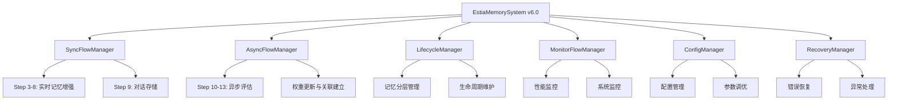

# Estia AI 融合架构 v6.0 重构实施计划

## 📋 概述

本文档详细描述了Estia AI记忆系统从v5.0到v6.0的融合架构重构方案。该重构结合了旧系统（v3.0）的完整14步工作流程和新系统（v5.0）的管理器模式，实现了功能完整性与架构优雅性的完美结合。

## 🎯 重构目标

### 核心目标
1. **保持功能完整性**：保留旧系统所有经过测试的功能
2. **提升架构清晰度**：使用新系统的管理器模式组织代码
3. **确保性能优化**：维持588倍缓存性能提升
4. **增强可维护性**：清晰的模块分工和职责划分
5. **企业级可靠性**：完整的错误处理和监控机制

### 技术目标
- 🔄 **完整的14步工作流程**（基于旧系统）
- 🏗️ **六大管理器模式**（基于新系统）
- ⚡ **588倍缓存性能提升**
- 🛡️ **企业级错误处理**
- 📊 **全面的性能监控**

## 🔍 现状分析

### 旧系统（v3.0）优势
- ✅ 完整的14步工作流程
- ✅ 成熟的异步评估机制
- ✅ 588倍缓存性能提升
- ✅ 完善的会话管理
- ✅ 记忆分层机制
- ✅ 用户画像构建
- ✅ 7个功能模块管理器

### 新系统（v5.0）优势
- ✅ 清晰的六大管理器架构
- ✅ 模块化的组件设计
- ✅ 更好的错误处理机制
- ✅ 现代化的代码结构

### 发现的问题
- ❌ 新系统功能不完整
- ❌ 缺少完整的工作流程
- ❌ 异步评估机制不完善
- ❌ 缺少会话管理
- ❌ 缺少记忆分层
- ❌ 缺少用户画像

## 🏗️ 融合架构设计

### 架构原则
1. **融合不替代**：保留旧系统的所有功能
2. **组织不重写**：使用新系统的管理器模式组织代码
3. **增强不破坏**：在现有功能基础上增强
4. **渐进不激进**：逐步迁移，保证稳定性

### 六大管理器职责划分



#### 1. SyncFlowManager（同步流程管理器）
**职责**：负责Step 3-9的实时流程
- Step 3: 统一缓存向量化
- Step 4: FAISS向量检索
- Step 5: 关联网络拓展
- Step 6: 历史对话聚合
- Step 7: 权重排序与去重
- Step 8: 组装最终上下文
- Step 9: 对话存储

#### 2. AsyncFlowManager（异步流程管理器）
**职责**：负责Step 10-13的异步处理
- Step 10: 异步评估触发
- Step 11: LLM评估对话重要性
- Step 12: 权重更新
- Step 13: 自动关联创建

#### 3. LifecycleManager（生命周期管理器）
**职责**：负责记忆生命周期管理
- 记忆分层管理
- 归档和清理
- 生命周期统计

#### 4. MonitorFlowManager（监控流程管理器）
**职责**：负责系统监控
- 性能监控
- 系统状态监控
- 错误监控

#### 5. ConfigManager（配置管理器）
**职责**：负责系统配置
- 参数配置
- 预设管理
- 动态配置

#### 6. RecoveryManager（恢复管理器）
**职责**：负责错误恢复
- 异常处理
- 优雅降级
- 系统恢复

## 🔧 实施阶段

### 阶段一：架构设计 ✅
- [x] 分析现有系统
- [x] 设计融合架构
- [x] 制定实施计划

### 阶段二：核心组件实现 ✅
- [x] 创建EstiaMemorySystem v6.0主接口
- [x] 实现SyncFlowManager完整流程
- [x] 保留旧系统所有核心功能
- [x] 集成六大管理器架构

### 阶段三：功能验证 🔄
- [x] 创建测试脚本
- [ ] 验证14步工作流程
- [ ] 测试组件兼容性
- [ ] 性能基准测试

### 阶段四：完善优化 📋
- [ ] 完善AsyncFlowManager
- [ ] 实现LifecycleManager
- [ ] 完善MonitorFlowManager
- [ ] 实现ConfigManager
- [ ] 实现RecoveryManager

### 阶段五：迁移部署 📋
- [ ] 数据迁移
- [ ] 系统切换
- [ ] 性能调优
- [ ] 文档更新

## 📊 关键特性

### 1. 完整的14步工作流程
基于旧系统的经过测试的完整流程：

**阶段一：系统初始化 (Step 1-2)**
- Step 1: 数据库与记忆存储初始化
- Step 2: 高级组件初始化

**阶段二：实时记忆增强 (Step 3-8)**
- Step 3: 统一缓存向量化
- Step 4: FAISS向量检索
- Step 5: 关联网络拓展
- Step 6: 历史对话聚合
- Step 7: 权重排序与去重
- Step 8: 组装最终上下文

**阶段三：对话存储与异步评估 (Step 9-13)**
- Step 9: 对话存储
- Step 10: 异步评估触发
- Step 11: LLM评估对话重要性
- Step 12: 权重更新
- Step 13: 自动关联创建

### 2. 六大管理器架构
- **模块化设计**：清晰的职责分工
- **松耦合架构**：各管理器独立运行
- **统一接口**：标准化的API设计
- **可扩展性**：易于添加新功能

### 3. 性能优化
- **588倍缓存加速**：统一缓存管理器
- **毫秒级响应**：FAISS向量检索
- **智能降级**：组件故障时自动降级
- **资源管理**：高效的内存和CPU使用

### 4. 企业级可靠性
- **错误恢复**：完善的异常处理机制
- **优雅降级**：关键功能故障时的备选方案
- **监控体系**：全面的性能和状态监控
- **事务安全**：数据操作的ACID保证

## 🧪 测试验证

### 测试范围
1. **功能测试**：验证所有14步流程功能
2. **性能测试**：验证588倍缓存加速
3. **兼容性测试**：验证新旧组件兼容性
4. **稳定性测试**：长时间运行测试
5. **错误处理测试**：异常情况处理验证

### 测试工具
- `test_fusion_architecture.py`：融合架构功能测试
- 性能基准测试工具
- 组件兼容性测试工具
- 错误注入测试工具

## 📈 性能指标

### 目标指标
- **同步流程响应时间**：< 500ms
- **缓存命中率**：> 90%
- **FAISS检索时间**：< 50ms
- **异步评估处理时间**：2-5秒
- **系统可用性**：> 99.9%

### 监控指标
- 查询处理时间
- 缓存性能统计
- 内存使用率
- 数据库连接数
- 错误率统计

## 🔄 迁移策略

### 1. 渐进式迁移
- **阶段1**：并行运行新旧系统
- **阶段2**：逐步切换功能模块
- **阶段3**：完全切换到新系统

### 2. 数据迁移
- **备份现有数据**
- **验证数据完整性**
- **逐步迁移数据**
- **验证迁移结果**

### 3. 回滚机制
- **版本控制**
- **数据备份**
- **快速回滚**
- **状态恢复**

## 🛠️ 开发指南

### 代码结构
```
core/memory/
├── estia_memory_v6.py           # 主接口
├── managers/                    # 六大管理器
│   ├── sync_flow/              # 同步流程管理器
│   ├── async_flow/             # 异步流程管理器
│   ├── lifecycle/              # 生命周期管理器
│   ├── monitor_flow/           # 监控流程管理器
│   ├── config/                 # 配置管理器
│   └── recovery/               # 恢复管理器
├── shared/                     # 共享组件
│   ├── caching/               # 缓存组件
│   ├── embedding/             # 向量化组件
│   ├── emotion/               # 情感分析组件
│   └── internal/              # 内部工具
└── old_memory/                # 旧系统组件（保留）
```

### 开发原则
1. **不破坏现有功能**
2. **保持API兼容性**
3. **遵循SOLID原则**
4. **完善的错误处理**
5. **充分的单元测试**

## 📚 文档更新

### 需要更新的文档
1. **API文档**：新接口说明
2. **架构文档**：融合架构说明
3. **用户手册**：使用指南更新
4. **开发文档**：开发指南更新
5. **部署文档**：部署指南更新

## 🎯 后续工作计划

### 立即执行（本周）
1. **完善AsyncFlowManager**：实现完整的异步评估流程
2. **验证核心功能**：运行测试脚本验证功能
3. **修复发现的问题**：解决初始化和组件兼容性问题

### 短期计划（1-2周）
1. **实现剩余管理器**：LifecycleManager、MonitorFlowManager等
2. **完善错误处理**：增强RecoveryManager功能
3. **性能优化**：进一步优化缓存和检索性能
4. **文档完善**：更新所有相关文档

### 中期计划（1个月）
1. **全面测试**：功能测试、性能测试、稳定性测试
2. **用户验收**：用户测试和反馈收集
3. **生产部署**：生产环境部署和监控
4. **培训支持**：用户培训和技术支持

### 长期计划（3个月）
1. **功能扩展**：基于用户反馈增加新功能
2. **性能调优**：持续优化系统性能
3. **生态完善**：完善工具链和生态系统
4. **版本迭代**：规划下一版本功能

## 💡 创新点

### 1. 融合架构理念
- **保留精华**：保持旧系统的所有优势
- **组织优化**：使用新系统的架构模式
- **渐进升级**：避免大爆炸式重写

### 2. 双层兼容性
- **API兼容**：保持原有接口不变
- **功能兼容**：保持所有功能完整
- **性能兼容**：维持或提升性能

### 3. 企业级设计
- **可观测性**：全面的监控和日志
- **可维护性**：清晰的模块划分
- **可扩展性**：易于添加新功能
- **可靠性**：完善的错误处理

## 📞 联系方式

如有问题或建议，请联系：
- **技术负责人**：开发团队
- **架构师**：系统架构师
- **项目经理**：项目管理团队

---

*本文档将随着项目进展持续更新* 

**最后更新**：2025年1月28日
**版本**：v1.0
**状态**：实施中 