# 认知记忆体系设计文档 - 完整技术规范

## 1. 概述与设计原则

### 1.1 系统概述
本系统是为 LLM（大语言模型）设计的认知记忆体系，不是模拟人类记忆，而是**增强** LLM 的原生认知能力。通过将 LLM 的上下文窗口映射为工作记忆，配合外部长期记忆系统，实现跨会话的知识积累和智能检索。

### 1.2 核心设计原则
1. **极简接口**：Memory 只有 remember/recall 两个方法
2. **扁平结构**：去掉不必要的抽象层
3. **统一入口**：Cognition 继承 Memory 并增加 prime 方法
4. **智能分发**：内部自动识别内容类型
5. **拟人化命名**：所有接口命名贴近认知心理学概念
6. **职责分离**：语义理解归 AI，结构存储归系统

### 1.3 认知心理学基础
系统设计基于认知心理学的**双重处理理论（Dual Process Theory）**：
- **System 1（快思考）**：自动、快速、直觉、无意识
- **System 2（慢思考）**：受控、缓慢、理性、有意识

## 2. 核心架构

### 2.1 系统 UML 图
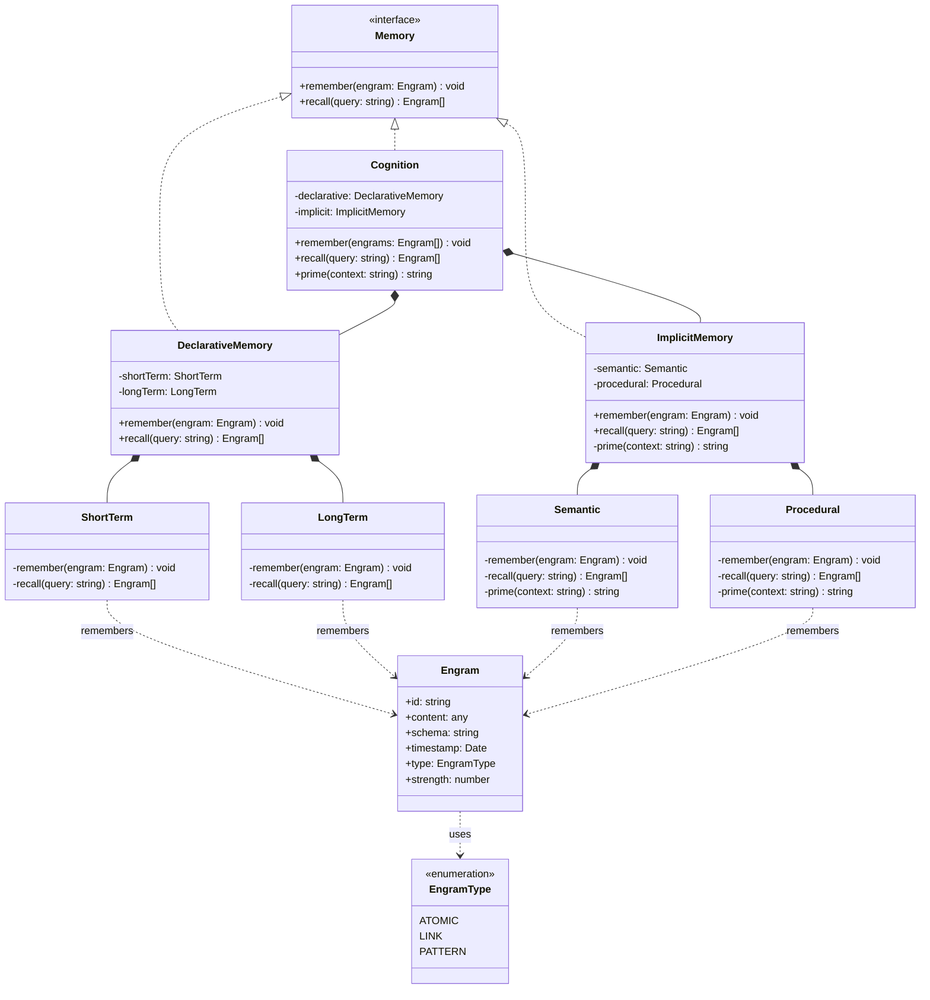

### 2.2 架构设计思想
- **接口最小化**：只暴露必要的操作
- **实现内聚化**：每个组件职责单一明确
- **认知映射化**：直接对应认知心理学概念

## 3. 工作记忆：LLM 上下文窗口的映射

### 3.1 核心概念
**工作记忆 = LLM 的上下文窗口**

这不是模拟，而是自然映射：
```
人类认知                    LLM 认知
---------                  ----------
感觉输入 → 工作记忆 → 输出    输入 → 上下文窗口 → 输出
         ↕                        ↕
      长期记忆                 外部记忆系统
```

### 3.2 三大操作的信息流
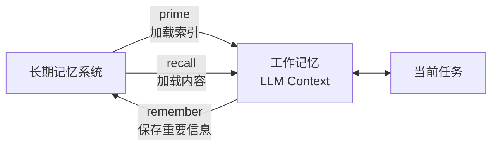

### 3.3 设计思想
- **自然适配**：利用 LLM 已有的工作记忆机制
- **Token 经济**：prime 省 token，recall 给细节
- **认知一致**：符合人类的记忆工作方式

## 4. DeclarativeMemory（陈述性记忆）

### 4.1 整体设计
DeclarativeMemory 对应认知心理学的 **System 2（慢思考）**，负责有意识的、受控的记忆处理。

### 4.2 ShortTerm（短期记忆）

#### 4.2.1 UML 结构
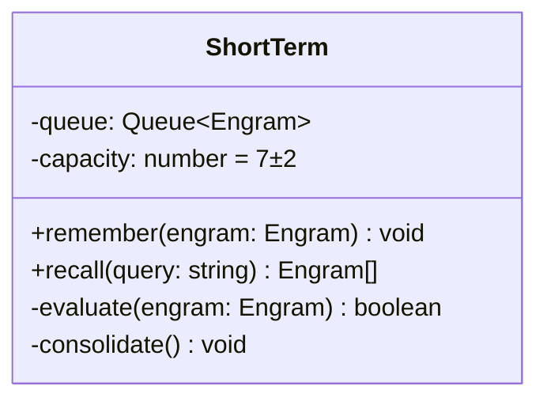

#### 4.2.2 工作序列图
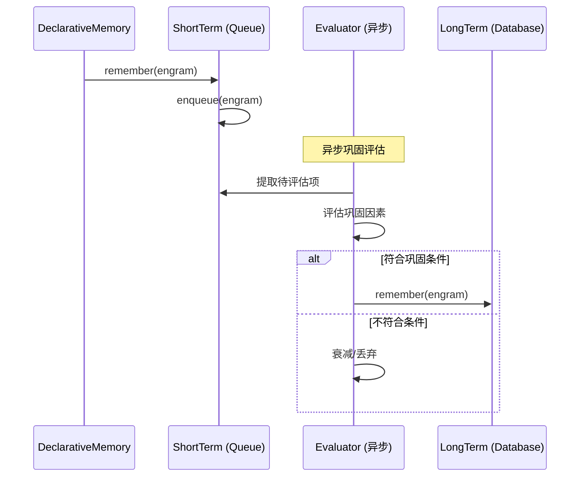

#### 4.2.3 认知心理学基础
对应 **Memory Consolidation（记忆巩固）** 过程：
- 新记忆最初处于不稳定状态
- 通过巩固过程转化为稳定的长期记忆
- 巩固涉及编码强度、重复、关联等因素

#### 4.2.4 设计思想
- **缓冲池模式**：类似 CPU Cache，暂存待评估信息
- **智能筛选**：防止无价值信息污染长期记忆
- **异步处理**：不阻塞主流程

### 4.3 LongTerm（长期记忆）

#### 4.3.1 UML 结构
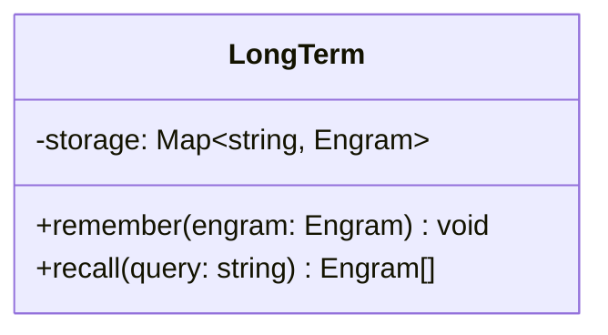

#### 4.3.2 工作序列图
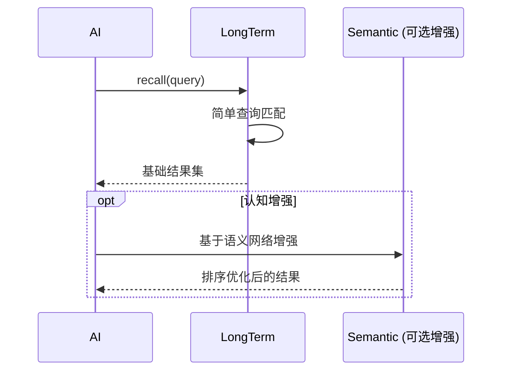

#### 4.3.3 认知心理学基础
对应人类的 **长期记忆存储**，但通过职责分离简化实现：
- 存储职责 → LongTerm（简单数据库）
- 认知职责 → ImplicitMemory（语义网络）

#### 4.3.4 设计思想
- **单一职责**：只负责可靠存储
- **简单可靠**：数据库级的稳定性
- **认知分离**：复杂认知功能由 ImplicitMemory 提供

## 5. ImplicitMemory（内隐记忆）

### 5.1 整体设计
ImplicitMemory 对应认知心理学的 **System 1（快思考）**，负责自动的、无意识的记忆处理。

### 5.2 Semantic（语义记忆）

#### 5.2.1 UML 结构
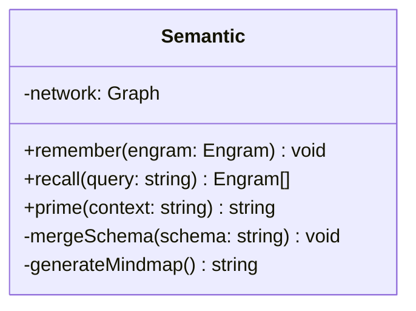

#### 5.2.2 语义网络构建原理
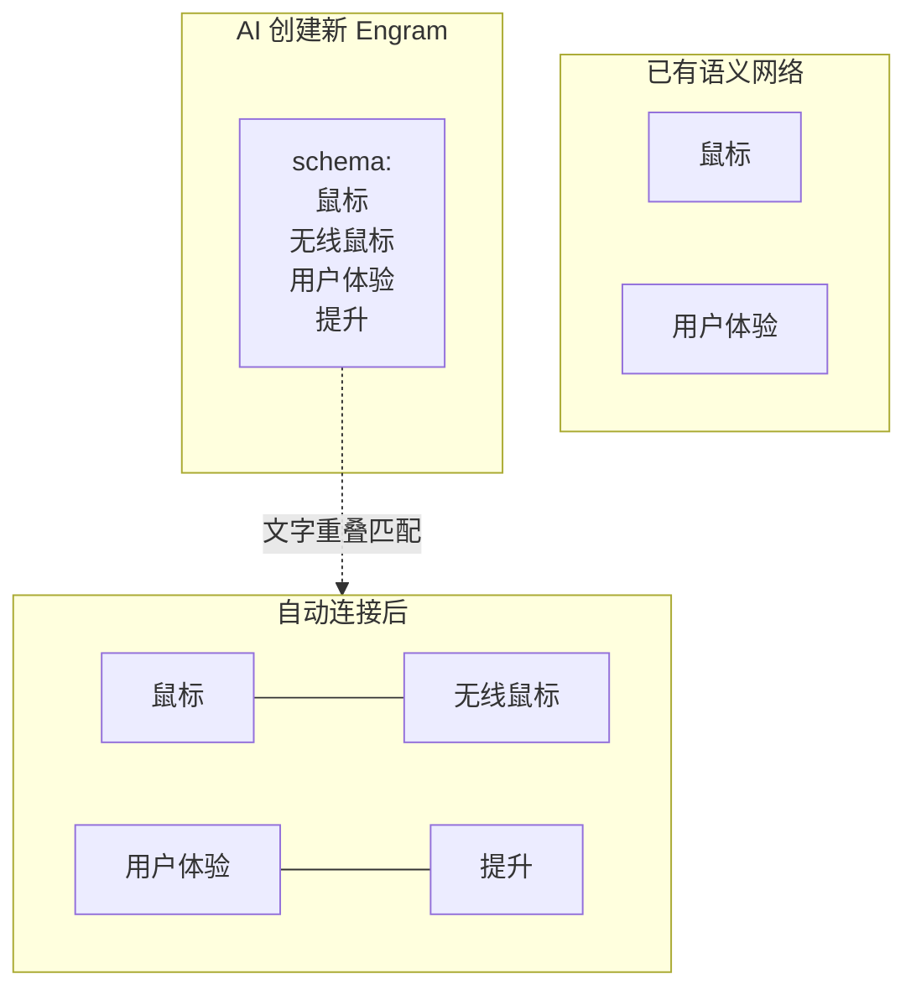

#### 5.2.3 认知心理学基础
对应 **语义网络理论**：
- 知识以网络形式组织
- 通过激活扩散进行检索
- 关联强度影响激活速度

#### 5.2.4 设计思想
- **文字重叠法**：通过相同词汇自动建立连接
- **AI 负责语义**：系统只做结构存储
- **极简实现**：只需字符串匹配，无需 NLP

### 5.3 Procedural（程序性记忆）

#### 5.3.1 设计理念
- 存储"如何做"的知识（技能、习惯）
- 在角色激活时自动加载
- 不参与 recall 操作（无需有意识回忆）

## 6. 三大核心操作

### 6.1 Remember 操作

#### 6.1.1 序列图
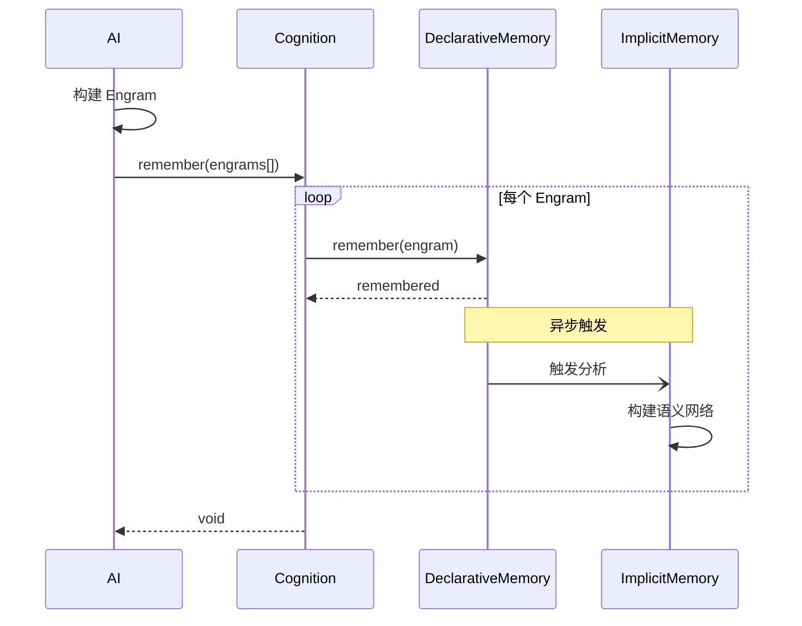

#### 6.1.2 设计思想
- **主路径极简**：直接存入 DeclarativeMemory
- **异步增强**：ImplicitMemory 后台处理
- **无阻塞设计**：快速响应

### 6.2 Recall 操作

#### 6.2.1 序列图
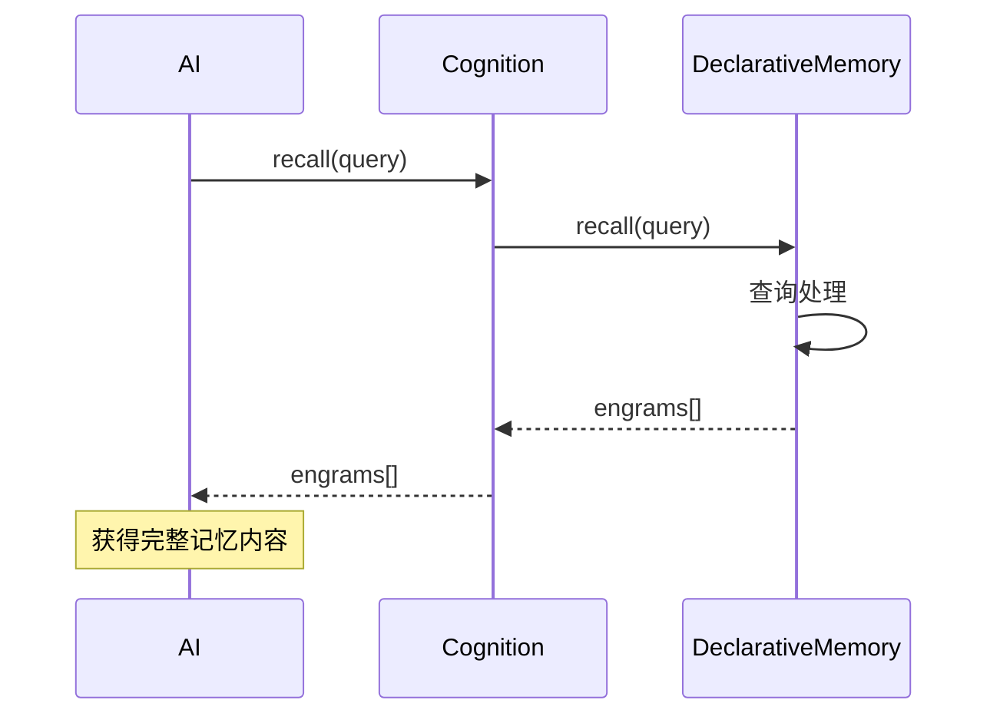

#### 6.2.2 设计思想
- **有意识回忆**：只查询 DeclarativeMemory
- **完整内容**：返回详细的 Engram 信息
- **简单直接**：不涉及复杂的认知处理

### 6.3 Prime 操作

#### 6.3.1 序列图
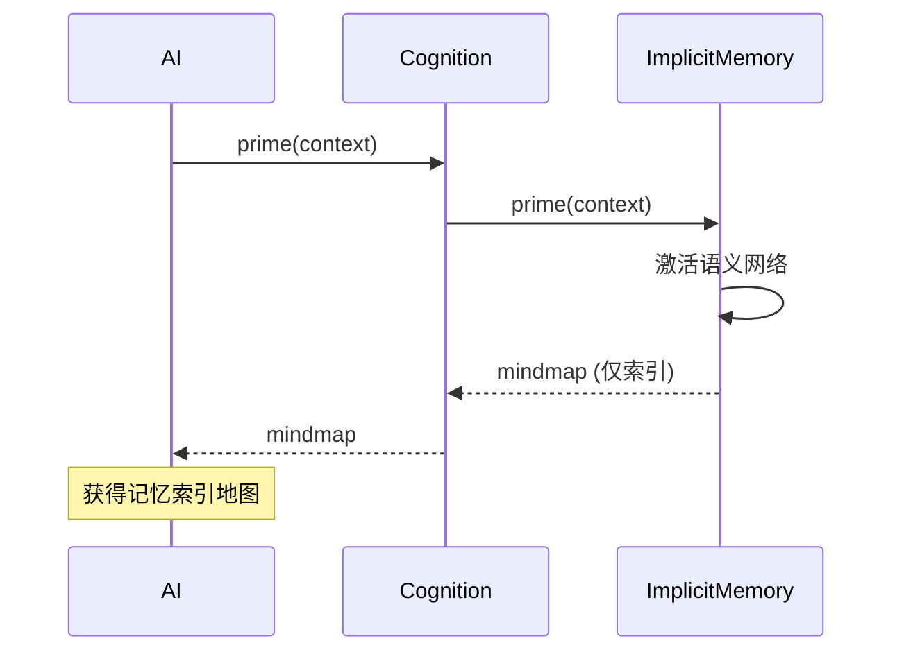

#### 6.3.2 设计思想
- **轻量激活**：只返回 mindmap 索引
- **Token 节省**：避免占用过多上下文
- **快速响应**：对应 System 1 的快思考

## 7. Engram 数据结构

### 7.1 核心设计
```typescript
class Engram {
    id: string           // 唯一标识
    content: any         // 自然语言内容
    schema: string       // 结构化认知（Mermaid 格式）
    timestamp: Date      // 时间戳
    type: EngramType     // ATOMIC | LINK | PATTERN
    strength: number     // 记忆强度
}
```

### 7.2 三种类型的含义

#### 7.2.1 ATOMIC（原子记忆）
提取关键概念：
```
content: "用户喜欢简洁的设计"
schema: "用户偏好
          简洁设计"
```

#### 7.2.2 LINK（关联记忆）
记录关系词：
```
content: "重构导致代码简化"
schema: "导致"  // 纯粹的关系词
```

#### 7.2.3 PATTERN（模式记忆）
识别重复模式：
```
content: "每次重构后代码都变简洁了"
schema: "重构
          导致
            代码简化
              重复模式"
```

### 7.3 设计思想
- **自然语言优先**：content 完全自由
- **结构化认知**：schema 格式统一但语义自由
- **AI 自主性**：AI 决定如何组织 schema

### 7.4 AI 生成 Engram 的提示词设计

#### 7.4.1 前置条件
- AI 已通过 prime() 操作看到当前语义网络
- AI 理解现有的知识结构和节点名称
- AI 可以自主决定如何建立连接

#### 7.4.2 生成指南
```markdown
## 创建记忆 Engram

基于当前对话内容，创建合适的 Engram 记录重要信息。

### Engram 结构
- content: 自然语言描述（完整保留原始信息）
- type: ATOMIC（单一概念）| LINK（关系） | PATTERN（模式）
- schema: Mermaid mindmap 格式的结构化表示

### Schema 格式说明
使用 Mermaid mindmap 语法：
```
根节点
  子节点1
    子子节点
  子节点2
```

### Type 判断指南
- ATOMIC: 描述单一事实、概念或状态
- LINK: 主要表达关系（当 content 包含"导致"、"影响"、"成为"等关系词时）
- PATTERN: 识别到的重复模式或规律

### 重要提示
- 在 schema 中优先使用已存在的节点名称，以建立知识连接
- LINK 类型的 schema 可以很简单，甚至只包含关系词
- 保持 schema 简洁，避免过度层级
```

#### 7.4.3 生成示例
```typescript
// 场景：AI 已看到语义网络包含 "鼠标"、"用户体验" 等节点

// 示例 1：ATOMIC 类型
{
  content: "无线鼠标的电池续航通常为 6 个月",
  type: "ATOMIC",
  schema: `鼠标
  无线鼠标
    电池续航
      6个月`
}

// 示例 2：LINK 类型
{
  content: "无线鼠标提升了用户体验",
  type: "LINK",
  schema: `无线鼠标
  提升
    用户体验`
}

// 示例 3：PATTERN 类型
{
  content: "每次产品迭代都会收集用户反馈并改进体验",
  type: "PATTERN",
  schema: `产品迭代
  触发
    用户反馈
      导致
        体验改进
          循环模式`
}
```

#### 7.4.4 设计理念
1. **上下文感知**：AI 知道现有知识网络，能做出智能连接
2. **格式标准化**：使用 Mermaid mindmap 保证可解析性
3. **语义自由**：AI 自主决定节点命名和层级组织
4. **自然连接**：通过文字重叠自动建立知识关联

## 8. 系统设计总结

### 8.1 核心创新
1. **工作记忆映射**：将 LLM 上下文窗口自然映射为工作记忆
2. **文字重叠法**：极简的语义网络构建方案
3. **职责分离**：AI 负责理解，系统负责存储
4. **三层架构**：工作记忆 ↔ 长期记忆 ↔ 语义网络

### 8.2 认知心理学对应
- **双重处理理论**：System 1/2 → Implicit/Declarative
- **记忆巩固**：ShortTerm 的评估筛选机制
- **语义网络**：Semantic 的知识组织方式
- **工作记忆**：LLM 上下文窗口的自然映射

### 8.3 工程优势
- **极简实现**：每个组件都足够简单
- **高可靠性**：简单系统更稳定
- **易扩展性**：清晰的接口和职责
- **高性能**：避免复杂的 NLP 处理

### 8.4 未来展望
这个设计不是在模拟人类认知，而是在**增强** AI 的原生能力。通过简单而优雅的设计，让 AI 能够：
- 积累跨会话的知识
- 构建知识关联网络
- 高效管理上下文资源
- 实现真正的"学习"能力

整个系统体现了**奥卡姆剃刀**原则：如无必要，勿增实体。每个设计决策都是为了用最简单的方式解决实际问题。